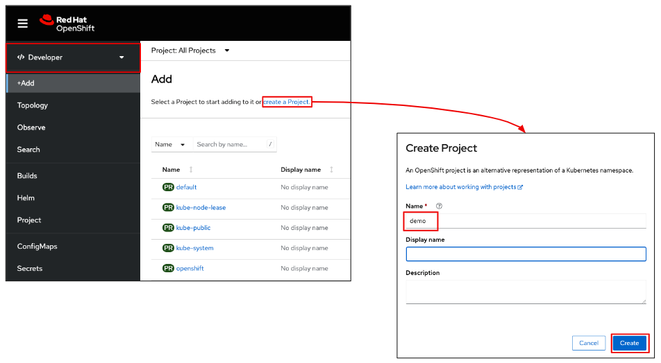

# OpenShiftWorkshop

OpenShift Console
Red Hat OpenShift as an application platform helps customers focus on improving application development and delivery, securely at scale, by bringing development, operations, and security teams together on a single platform and reducing the complexities associated with modern application architectures and hybrid cloud infrastructures.

Today I wanted to walk you through a few of what I call “quality of life” features of the platform for both developers and administrators - the things that help these roles get their jobs done and as a result drives better business outcomes.

Build & Deploy Application (Developer View)
	Create Project (Parksmap-Web)
Let’s start with the developer perspective. Just as with traditional “desktop” based development- I need a way to organize my applications, configurations, dependencies, etc.

In a multi-tenant environment, a Kubernetes namespace provides a mechanism to scope resources in a cluster, and in OpenShift, a project is a Kubernetes namespace with additional annotations that allows a community of users to organize and manage their content in isolation from other communities. So lets go ahead and create a project that we will work within today.

[click on Project tab] Now once we’ve created our project, lets view it and talk to some functionality you are provided here in the OpenShift console.
	Project Overview

Projects have role based access controls and users must be given access and permissions to projects by administrators. For example, developers get edit access while testers get read only access. There are two types of RBAC roles and bindings that control authorization (Cluster & Local RBAC). Admins utilize cluster roles and bindings to control who has various access levels to the OCP platform itself and all projects within it. Your developers use local roles and bindings to control who has access to their project.

	Developer Catalog

Now, when it comes to running workloads on OpenShift, there are a number of ways to do this, but let’s take a look at a couple of the most popular. We will start with the Developer Catalog [Add, Developer Catalog (All services)

The Developer Catalog contains a collection of ready to run application components or application builders you can add to your project that allows you to quickly start building. This repository contains the building blocks that simplify the development process and enables developers to quickly create & deploy applications on OpenShift. 
These include Red Hat created, as well as components from Red Hat’s large ecosystem of communities and enterprise partners. Now here, Developers can pick & choose from these components and easily integrate them into their application without worrying about the complex setup and configuration. Cluster administrators can also customize the content made available in the catalog to ensure only authorized components get used on clusters. [click on languages filter on left] For example say .NET programming language doesn’t play nicely within the rest of your environment. Your admin can filter out this language from OCP all together so developers never see it as an option.
	Application Source-to-Image

https://github.com/openshift-roadshow/parksmap-web.git 
Now, as you see in the developer catalog, there are lots of ways to get a workload running on OpenShift- but lets look at it from the most basic developer level [click +Add, click Import from Git]- I have source code that I’ve written and I want to compile and run my application. [show github tab]. I am going to copy this source code from github, and paste it here into my OpenShift console. 

What we are seeing here is Source-to-Image. (or S2i for short) this is a toolkit and workflow for building reproducible ready-to-run images without a developer needing to know anything about how to create containers - allowing developers to simply focus on writing their application code like you saw in github. In this case, we’re going to simply point the S2I at a github repository where our parksmap application code is stored. [Paste github link] As you can see, S2I is able to detect the type of application from the source code and selects the appropriate builder image. [import github, leave defaults] As you can see here OCP was able to detect this source code as using Dockfiles and suggest we use this to build our image. 

	

Topology View & Builds

After we start the build of the application, the console switches to the Topology view. This view provides a visual representation of all the applications within a project, their build status, and the components and services associated with them. In our case, we have a single component, but in more complex scenarios you’d be able to see many different components and their relationships; for example, if we had an application with a backend database and a front end application we would see those two components here in this view. From here we can get additional information about our application- in our case let’s take a look at the build progress. 

Here we can see the log file output from the S2I builder image- pulling source code, compiling, packaging with runtime container images from the local and official Red Hat container registry. Once the build is complete, our new application image is stored in the OpenShift registry and deployed to our project.

*** Since the build can take up to a minute to complete,  lets use this time to talk about Operators in OCP *** [Switch to Admin view, Operators, OperatorHub]
An Operator is just a Pod that does something in a reliable, repeatable, and observable way. They act like an extension of the Kubernetes and OpenShift API and allow you to manage new resource types. 

Instead of installing and managing another piece of software, Operators watch over your OpenShift environment and use its current state to make decisions in real time. You can think of Operators as the runtime that manages a specific type of application on Kubernetes.

Operators automate actions usually performed manually, reducing the chances for errors and simplifying complexity. 	
You can see here that we provide a large variety of operators within OpenShift, ranging from database operators to streaming & messaging operators. Now, these operators are broken into Sources (we have 4 of them [highlight source])

Red Hat: Red Hat Operators are operators developed and maintained by Red Hat. These operators are designed to work seamlessly with Red Hat products and provide additional capabilities and integrations for managing various components of the OpenShift platform or Red Hat ecosystem.
Certified: Certified Operators are thoroughly tested, verified, and supported by both Red Hat and the independent software vendor (ISV). They undergo a rigorous certification process to ensure compatibility, reliability, and security. Certified Operators offer a higher level of assurance and are recommended for production deployments.
Community: Community Operators are developed and maintained by the open-source community. These operators may not have the same level of testing and support as Certified Operators, but they are actively maintained and provide valuable functionality. Giving you flexibility and a wide range of choices when it comes to integration.
Marketplace: Market place operators are operators that come from vendors but come at a cost to you to utilize. 

Lets circle back to our developer view and check to see if our application is finished building and deploying [switch to Developer view]
Application Deployed

Back here on the Topology view, we can see the build is complete and we have an instance of our application running. Lets launch our application to verify it is working. 

Application Rolling Update
	Deployment Details
[click app, name at top]

Now let’s take a look at OpenShift’s deployment strategy feature. A deployment strategy is a way to change or upgrade an application. The aim here is to make the change without downtime in a way that the user barely notices when the improvements are pushed. There are a number of strategies that can be used, but today we’ll first look at the Rolling strategy which is the default strategy commonly used.

As you can see our current update strategy is currently set to rollingupdate [highlight on screen] We can now scale this application up to 10 pods. 
Manual Scale Up & Update Strategy

The rolling deployment we just saw slowly replaced instances of the previous version of our application with instances of the new version of the application. This deployment waits for new pods to become ready via a readiness check before scaling down the old components. If a significant issue occurs, the rolling deployment can be aborted.

As you all saw, this is quick and easy to do with just a click of a button to scale up or scale down your pods.

	Environment Variables

There are a number of ways to trigger an application update such as executing a new build, or updating a tag in the container image registry. Because container images are designed to be immutable, one way to provide dynamic configuration is through environment variables. Today we’re going to trigger the application redeployment by just simply injecting some environment variables into the application image. On this [environment] tab here, we’re just going to create a new environment variable for our application and click save. When we do, I will quickly switch back to the details view and we’ll be able to observe OpenShift rolling out the new changes. [Switch to details view quickly] 
	
Observe Rolling Update

And as you can see just like that, OpenShift has scaled up new instances of the application, while scaling down old instances of the application to give us a zero downtime deployment. This happens quickly - which is one reason why containers are so popular for modern applications.. Now there are also more complex route based strategies including A/B or Blue-Green that are supported in OCP as well. But we can surely schedule a follow up call and demo this strategy if it fits your org’s use case. 

Before I show you all another way we can scale our application, let me first install an operator which I’ll utilize in the next section and scale down my application [scale down to 1 pod] [Switch to Admin View, Operators, OperatorHub, search ‘web terminal’, install] One thing I would like to point out here with Operators is how OpenShift will automatically install any dependencies needed for your chosen operator. As we can see, DevWorkspace Operator has been installed prior to our web terminal operator. Now that our operator has been installed, lets refresh our window for it to be applied to our console.
Application Scaling
	Resource Limits

One major benefit to containerizing is the ability to scale horizontally (like mentioned in my presentation) This is going to allow you to meet high workload demands ensuring high availability for your application. 
Autoscaling is a wonderful feature for enabling the automatic scaling of workloads based on demand - to scale up to meet spikes and scale down to free resources when not needed. This is going to be critical for businesses trying to optimize their costs. 

In order to do this, first we’ll need to set some resource limits for our application. [click on app, details, actions, edit resource limits] In a multi-tenant environment, a critical feature is having the ability to enforce boundaries to ensure applications don’t adversely impact others or prevent runaway costs from unexpected consumption. Let’s set some thresholds for CPU and memory usage for running pods. 

	Pod Autoscaler

Now that we have the resource limits set for our application pods, we can set a minimum and maximum number of pods we want as well as the CPU and memory consumption triggers. 
[details, actions, Add HorizontalPodAutoscaler]
Today I’m going to set these really low to show how this works, but in reality you’d probably set these at something like 80% or whatever your preferred utilization metric is.
	Autoscaled Application

*** NOTE: with thresholds so low, you will likely see pods autoscaling immediately, however, we will also use the web terminal operator to run a few curl commands to the application url ***
curl https://parksmap-web-git-demo.apps.cluster-j4x6f.j4x6f.sandbox500.opentlc.com/[1-5]
Ok after setting this, we can see here in the deployment details the pod autoscaler is starting new pods in accordance with our set thresholds. With realistic thresholds, when the load subsides, the autoscaler will start reducing the number of pods to match the lower demand, freeing up resources. [remove horizontal autoscaling]

User Experience
	Deployment Details

Now let’s explore some of the other features of the developer console that improve the quality of life for developers. Drilling into the deployment view, we can start to see additional details that will help us understand the current state. Being a completely integrated platform puts all of this information at the developers fingertips instead of them having to learn several different tools, keep track of hostnames/ips, manage SSH keys, etc. 
	Infrastructure as Code

While the console is very useful for fundamental developer activities, when it comes to running production systems, you’re likely to implement things like Infrastructure as Code (IaaC). The nice thing about the console is that it also gives you easy access to the underlying configurations for all of the key components of your deployments so you don’t have to figure out how to write these by hand. And these are reflected in real time, so if we go back to our details view and scale up the number of Pods running our application and come back to our YAML configuration we can see the replicas count has increased and vice versa. [show changing replicas in YAML, switch to details] These configurations can be saved to git repositories and used to programmatically deploy our applications.
	Pods

Under this view here, we can also look at the Pods (or instances) of the application that are currently deployed
Here we can see pod details like it’s status, the node it’s running on, it’s internal IP addr [click manage columns next to search, add IP address], any storage mounts, etc
We can also get some quick look metrics on CPU, memory, network utilization
If I dive into one of these running pods, we can…
[click on pod, click logs] 
Take a live look at the log files for that application to look for error or debug statements
And we can even open a live terminal in the running pod if we needed to conduct deeper activities like looking at environment variables [run ‘env’ command] or running utility scripts
	Administrator - Overview

Now switching context to an Administrator perspective, I wanted to take some time to show you just a few elements of the console that improve quality of life for those who are responsible for operating the core platform and the applications running on it.

Here the administrator console, as previously mentioned,  deploys, configures and manages core infrastructure of the platform for things like storage, network, compute, etc. simplifying monitoring and managing the overall cluster.
	Dashboard - Cluster

Administrators also have access to a preconfigured, and self-updating monitoring stack that provides monitoring for the core platform. Default dashboards in the console include visuals of cluster metrics to help you to quickly understand the state of your cluster. OpenShift can also integrate with 3rd party monitoring solutions that may already be used by the enterprise.
	Dashboards - Namespace

Additionally, administrators can enable monitoring for user-defined projects (such as the project we created earlier) with options for both project and application level metrics. [change dashboard to ‘Kubernetes/Computer Resources/Namespace(pods), change namespace to “demo”This gives real-time insights to specific application performance, as we can see here we are seeing performance metrics for our parksmap application we deployed earlier. 
	Alerting

And because hybrid cloud environments can be complex with many varied workloads, alerting is a feature that helps administrators find the signal in the noise to make sure any issues are identified rapidly. Alerts can be viewed in the Alerting UI in the web console or routed to receivers using things like PagerDuty, Email, Slack, etc enabling you to send timely notifications to the appropriate teams when alert conditions occur.
	
Cost Management

Finally today, I’d like to show you a feature we’ve seen a lot of demand for from customers who are looking for greater insights into their IT spend. Cost management provides cost visibility across hybrid and multicloud environments including OpenShift as well as underlying infrastructure costs. It aggregates costs and correlates spend to cluster consumption, so you’re able to gain cost transparency and showback in order to compare spend against allocated budgets to ensure resources are aligned and tracked back to your business priorities.

Optional Section to Add
Application Blue-Green Deployments (Optional)
	Deploy Application - Blue

https://github.com/mattzager/nodejs-rest-http.git

Next I’d like to show you how OpenShift can help development and operations teams with Blue-Green deployments. Blue-green deployments involve running two versions of an application at the same time and moving traffic from the in-production version (the blue version) to the newer version (the green version).

So the first thing we’ll do is deploy 2 versions of our application, a blue version and a green version. To do this we’ll make use of 2 different branches in our github repository. First I’ll deploy the blue branch. And note that I am unselecting the Create a route option- this means I do not want a public route for this service, it will only be reachable within the OpenShift cluster - and I’ll talk a little more about this in a minute.

	Deploy Application - Green

*** NOTE: create the green application right after the blue one- don’t wait for the blue to build ***

And here I’ll deploy the green branch.
	Applications Deployed

While the applications are building and deploying, let’s talk about how this will work. Each application has an associated Service. a Service is a method for exposing a network application that is running as one or more Pods in your cluster. The service abstracts request routing so as pods are created and destroyed or multiple pods are deployed for a single application, it is able to automatically connect to the correct pod instances. This is for internal communications. There is also the concept of a Route, a Route is able to expose an internal Service to external clients. So if we look at the original application we built and deployed the URL in my browser is the entry point of the Route from outside to inside the OpenShift cluster.

The reason we deployed our Blue and Green applications without Routes was because we don’t want external users to be able to access them until we are ready. So we can use the internal service endpoints to do internal testing and validation and once we are ready make it the new production application.
	View Route Details

Let’s take a look at the Route associated with our original application.
	Edit Route - Blue

Here we can see the configuration of the route including what service it is currently associated with. If we edit the route, we can change which Service the route is associated with, so let me update this to our new Blue service.
	View Application - Blue

Going back to my application in the browser, I’ll enter a name here and Invoke- and we see my new output from my Blue service.
	

Edit Route - Green

Let me update this to our new Green service.
	View Application - Green

I’ll enter a name here and Invoke- and we see my new output from my Green service. This is one example of how OpenShift makes it very easy for development and operations teams to perform sophisticated deployments of their applications.

